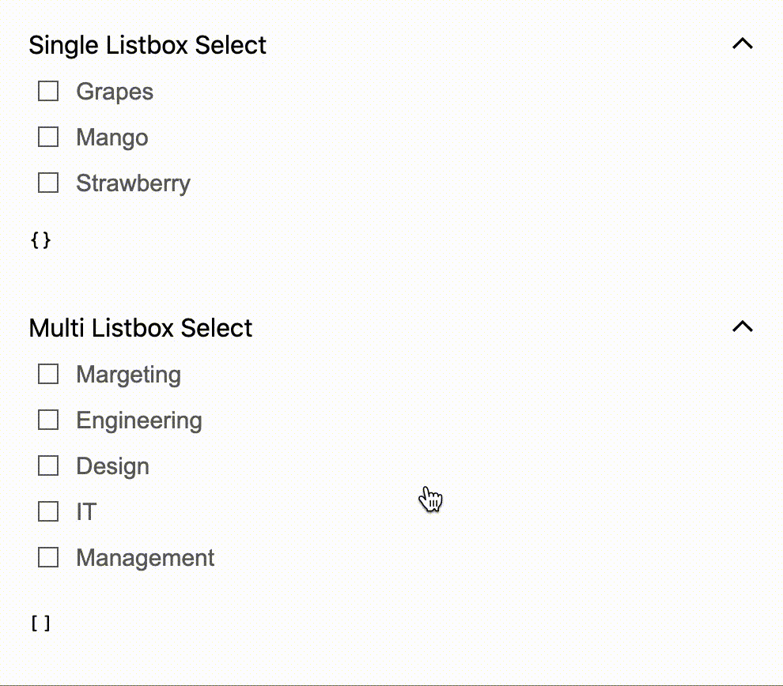

# react-listbox-select component

{:width="250px"}

# Usage

Import the component you want to use;

```javascript
import { ListboxSelect, ListboxSelectMultiple } from "react-listbox-select";
import "react-listbox-select/dist/react-listbox-select.css";
```

**Single Select**

```tsx
import React, { useState } from "react";
import { ListboxSelect } from "react-listbox-select";

const options = [
  { label: "Grapes 🍇", value: "grapes" },
  { label: "Mango 🥭", value: "mango" },
  { label: "Strawberry 🍓", value: "strawberry" },
];

const Example = () => {
  const [selected, setSelected] = useState([]);

  const selectChange = (list) => {
    setSelected(list);
  };

  return (
    <div>
      <h1>Select Options</h1>
      <pre>{JSON.stringify(selected)}</pre>
      <ListboxSelect
        title="Single Listbox Select"
        list={options}
        onChange={selectChange}
        value={selected}
        className="my-class-name"
        prefixId="SingleSelect"
      />
    </div>
  );
};

export default Example;
```

**Multi Select**

```tsx
import React, { useState } from "react";
import { ListboxSelectMultiple } from "react-listbox-select";

const options = [
  { label: "Grapes 🍇", value: "grapes" },
  { label: "Mango 🥭", value: "mango" },
  { label: "Strawberry 🍓", value: "strawberry" },
];

const Example = () => {
  const [selectedMultiple, setSelectedMultiple] = useState([]);

  const selectChangeMultiple = (list) => {
    setSelectedMultiple(list);
  };

  return (
    <div>
      <h1>Select Options Multiple</h1>
      <pre>{JSON.stringify(selectedMultiple)}</pre>
      <ListboxSelectMultiple
        title="Multi Listbox Select"
        list={options}
        onChange={selectChangeMultiple}
        values={selectedMultiple}
        className="my-class-name"
        prefixId="MultiSelect"
        scrollable={true}
        collapsible={true}
      />
    </div>
  );
};

export default Example;
```

## 👀 Props

| Prop          | Description                                                  | Type                   | Default   |
| ------------- | ------------------------------------------------------------ | ---------------------- | --------- |
| `title`       | Title for listbox                                            | `string`               |
| `list`        | Options for the listbox (is required)                        | `string`               |
| `className`   | className for the component                                  | `string`               |
| `onChange`    | onChange callback                                            | `function`             |
| `value`       | pre-selected option ListboxSelect (is required)              | `{ label:, value: }`   |
| `values`      | pre-selected options for ListboxSelectMultiple (is required) | `[{ label:, value: }]` |
| `prefixId`    | Id for aria id                                               | `string`               | `_single` |
| `scrollable`  | Makes the listbox scrollable                                 | `boolean`              | `false`   |
| `collapsible` | Makes the listbox collapsible                                | `boolean`              | `false`   |
